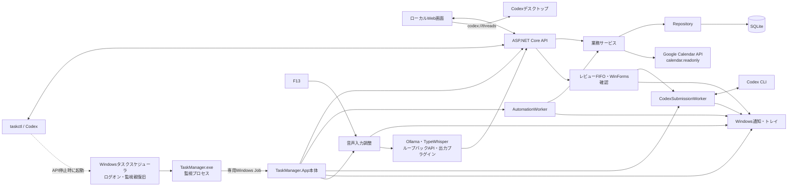

# システム概要

## 目的

仕事・私用の候補を一括評価し、判断負担を減らすため「今やること」を1件だけ返すWindowsローカルアプリです。タスク、プロジェクト背景、Google予定、作業時間をSQLiteへ統合します。

## 構成

| 構成要素 | 責務 |
|---|---|
| `TaskManager.App` | 監視・異常復旧、Web/API、業務処理、SQLite、常駐処理、Codex送信ワーカー、トレイ、静的画面 |
| `TaskManager.Cli` | `taskctl`の実行ホスト。ローカルAPIを呼び、DBへ直接接続しない |
| SQLite | タスク、依存関係、設定、履歴、予定キャッシュ、下書き、プロジェクト、作業ログ、通知台帳、アプリ状態 |
| Google Calendar | `calendar.readonly`で予定を取得。失敗時は最終キャッシュを継続使用 |
| Windows | タスクスケジューラによる監視親の独立起動・外側の復旧、DPAPIによるトークン保護、PC通知 |
| [音声入力](07_音声入力.md) | F13受付、TypeWhisper APIによる録音制御、Ollama並行準備、確認画面、Codex CLI送信を担う独立サブシステム |

## 起動とデータフロー

1. Windowsタスクスケジューラがログオン時に監視親をCodexなどの呼出元プロセスから独立して起動する。
2. 監視親が単一の本体を起動し、本体は単一起動Mutexを取得して`127.0.0.1:48120`でWebサーバーを開始する。
3. スキーマを初期化・移行し、実行中タスクとタイマーの不整合を修復する。
4. トレイと1分周期の常駐処理を開始する。
5. 画面またはCLIはローカルAPIを呼ぶ。
6. サービス層が検証・状態遷移を行い、Repositoryが履歴と関連データをSQLiteトランザクションへ保存する。
7. タスク変更後は推薦を即時再計算する。
8. F13から始まる音声入力は、TypeWhisperで校正し、利用者確認後にCodex CLIへ直列送信する。詳細は[音声入力](07_音声入力.md)を参照する。

## 異常終了時の動作

- 常駐本体は監視プロセスから起動する。
- 監視プロセスはWindowsタスクスケジューラから起動し、Codexのタスク切替や呼出元の終了と同じWindowsジョブへ依存しない。
- 本体は監視親専用のWindows Jobへ所属し、監視親が強制終了した場合は孤児化せず本体も終了する。Windowsはその後に監視親と本体を一組で復旧する。
- 本体が異常終了した場合は3秒後に自動再起動し、5分未満の連続失敗は最大3回までとする。
- 監視プロセス自体が異常終了した場合はWindowsが1分間隔で最大3回再起動する。本体の連続起動失敗による意図した停止は成功終了として扱い、外側で無限再起動しない。
- 監視プロセスもMutexで多重起動を防ぐ。
- 自動復旧時はWindows通知とダッシュボードの未確認警告でユーザーへ知らせる。
- 警告は確認済みにするまで維持し、エラー概要をコピーしてCodexへ共有できる。
- 3回連続で起動できない場合は自動再起動を停止し、Windowsダイアログを表示する。
- 詳細は`%LOCALAPPDATA%\TaskManager\logs`の`watchdog-*.log`、`watchdog-crash-*.log`、`crash-*.log`、`recovery-*.log`、`latest-system-incident.json`へ保存する。監視親と本体の開始・終了も`watchdog-*.log`へ記録する。

## セキュリティ境界

- 待受はループバック限定。`LocalRequestMiddleware`もローカル要求を検証する。
- OpenAI API、外部公開サーバー、Apps Script、Google Sheets同期は含めない。
- Google認証トークンはWindowsユーザー単位で暗号化し、Gitへ保存しない。
- ローカルアプリのCalendar権限と、CodexのGoogle Calendarプラグイン権限は別物として扱う。
- 音声入力もループバック限定で動作し、Codex送信は既存CLI認証を利用する。詳細な境界は[音声入力](07_音声入力.md)に記載する。
- 実データの正本はローカルSQLiteであり、他PC同期は対象外。

## 主な設計方針

- UIとCLIは同じAPI・業務ロジックを利用する。
- 変更元は`画面`、`Codex`、`システム`として履歴へ残す。
- 削除より中止・無効化を優先し、破壊的操作は明示確認を要求する。
- スキーマ変更前と毎日、SQLiteオンラインバックアップを作成して30世代保持する。
