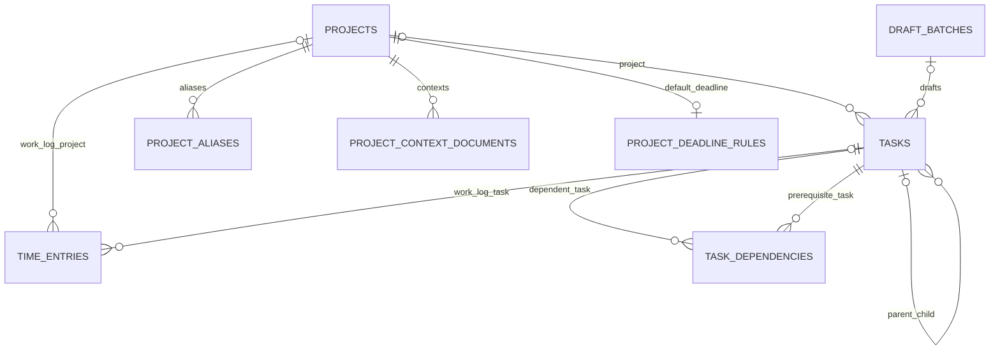

# データモデル

## SQLiteスキーマ版6

| テーブル | 内容 |
|---|---|
| `schema_versions` | 適用済みマイグレーション |
| `tasks` | タスク本体、状態、期限、見積、開始可能日、計算結果 |
| `task_dependencies` | タスクから先行タスクへの多対多参照 |
| `settings` | 文字列キー・値のアプリ設定 |
| `history` | 操作日時、種別、対象、変更元 |
| `calendar_events` | Google予定の14日キャッシュ |
| `draft_batches` | AI下書きバッチ、冪等キー、後処理結果 |
| `notification_ledger` | 朝通知、確認通知、日次処理の重複防止 |
| `application_state` | 最終同期日時・エラーなどの内部状態 |
| `projects` | 正式名称、状態、HSV表示色 |
| `project_aliases` | 確認済み表記ゆれ |
| `project_context_documents` | Markdown背景情報、有効期間、優先度 |
| `project_deadline_rules` | 毎週の既定期限 |
| `time_entries` | タスクまたは自由活動の作業区間、警告、確認状態 |

## 主な関連

`tasks.parent_identifier`、`tasks.draft_batch_identifier`、`task_dependencies.dependency_identifier`は論理参照であり、Service層が欠落参照や循環を検証します。その他の上記関連はSQLite外部キーで保持します。

## タスク状態

| 状態 | 意味 |
|---|---|
| `受信箱` | 入力直後で整理前 |
| `下書き` | AI分解結果。画面承認前は推薦対象外 |
| `要確認` | 不明点・依存中止などの確認が必要 |
| `実行可能` | 推薦・開始の候補 |
| `実行中` | 現在のタスク。原則1件 |
| `待機中` | 外部条件などを待つ |
| `完了` | 完了済み |
| `中止` | 完了とは別の終端状態。依存達成には使わない |

期限種別は`厳守`、`目安`、`なし`、期限由来は`explicit`、`project-default`、`none`です。新規入力の`auto`は保存時にいずれかへ具体化されます。

## 不変条件

- タスクIDとプロジェクトIDは表示名から独立した不変ID。
- 依存関係は循環、自己参照、欠落参照を検証してから保存する。
- 下書きバッチ内の`aiReferenceKey`は必須・一意で、仮依存を実IDへ解決してからコミットする。
- `draft_batches.request_key`はNULL以外で一意。同じキーの再送は既存結果を返す。
- 未終了かつ無効化されていない`time_entries`は部分一意索引により全体で1件だけ。
- 作業ログ日時の新規保存はUTCへ統一し、既存の異なるオフセット表記もSQLiteの絶対時刻変換で期間判定・並べ替えする。
- タスクまたはプロジェクトを削除しても作業ログは`SET NULL`と名称スナップショットで保持する。
- タスク本体、依存、履歴、タスク由来のタイマー遷移は`TaskRepository.SaveTaskAsync`の同一トランザクションで確定する。
- 新規タスクの開始可能日未指定時は登録日時を設定する。最後の先行タスク完了時は、明示された未来日時を早めず解放日時へ更新する。
- 全子タスクが完了または中止なら親を自動完了する。中止は後続タスクの依存達成にしない。

## 保存場所

| データ | 保存先 |
|---|---|
| DB | `%LOCALAPPDATA%\TaskManager\task-manager.db` |
| バックアップ | `%LOCALAPPDATA%\TaskManager\backups`、30世代 |
| Google資格情報 | `%LOCALAPPDATA%\TaskManager\credentials.json` |
| 暗号化トークン | `%LOCALAPPDATA%\TaskManager\tokens` |
| インポート一時データ | `%LOCALAPPDATA%\TaskManager\imports` |
| ログ | `%LOCALAPPDATA%\TaskManager\logs` |

テスト時だけ`TASKMANAGER_DATA_DIR`でデータディレクトリを差し替えます。これらの実データはGitへ追加しません。

`settings.codexThreadIdentifier`には音声入力の既定送信先となるCodexタスクUUIDを保存します。確認待ち本文とCLI送信待ちはメモリ内FIFOだけに保持し、SQLite、履歴、ログ、バックアップへ本文を保存しません。Codex CLIの応答も画面表示用に末尾最大4,000文字だけ一時保持し、永続化しません。

## カレンダー同期履歴

予定の全保存項目を比較し、追加・変更・削除がある場合だけ正常同期履歴を保存します。取得順序は無視し、変更がなくても最終成功日時は更新します。同じエラーの連続記録を抑止し、エラー内容の変化と成功への復旧を記録します。

版6への移行ではSQLiteバックアップを作成し、変更内容を持たない旧形式の正常同期ログを最新1件に整理してVACUUMで空き領域を回収します。エラー履歴・他の操作履歴・予定キャッシュは保持します。

## 操作履歴の保持期限

`history`は直近90日分を保持します。起動時と稼働中の日付変更後に、実行時刻の90日前より古い履歴を全種別まとめて削除します。境界時刻と一致する履歴、日時を解釈できない履歴は保持します。削除対象がある場合だけSQLiteバックアップを作成し、退避失敗時は削除しません。解放ページは再利用します。タスク本体・作業時間ログ・予定キャッシュ・通知台帳は対象外です。
