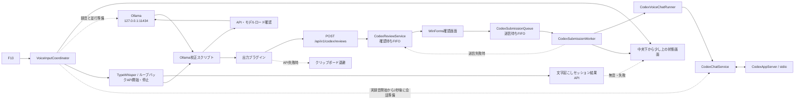

# 音声入力

## 目的と境界

F13から音声入力を開始し、TypeWhisperとOllamaで校正した本文を利用者が確認してから、Web UIと同じCodex会話へ送信するサブシステムです。

PC・Android・音声入力は[Codex会話](12_Codex会話.md)の`CodexChatService`と`CodexAppServer`を共有します。旧音声用送信先IDは互換性のため設定に残しますが、送信には使用しません。

- 音声認識と校正はTypeWhisper・Ollamaが担い、UniToDoは起動、状態表示、確認、送信を調整する。
- 業務タスク操作APIや`taskctl`とは別のレビューAPI経路だが、同じUniToDo常駐プロセス内で動作する。
- OpenAI APIは使わず、ChatGPTへログイン済みのCodex CLIを使う。
- 録音、校正本文、Codex応答はSQLite、履歴、アプリログへ保存しない。

## 全体フロー

## 構成要素

| 場所 | 責務 |
|---|---|
| `Services/VoiceInputCoordinator.cs` | 依存アプリ準備、単一起動制御、状態通知 |
| `Windows/VoiceInputRuntime.cs` | Ollama・TypeWhisper起動、両ループバックAPIの呼出し |
| `Windows/TypeWhisperApiClient.cs` | 認識モデル準備、音声校正ワークフロー、録音開始・停止状態の確認 |
| `Windows/VoiceInputHotkeyHost.cs` | 利用者向けF13のグローバル登録 |
| `Windows/VoiceInputStatusForm.cs` | フォーカスを奪わない進捗・結果表示 |
| `Services/CodexReviewService.cs` | 最大50,000文字の確認待ちをメモリ内FIFOで管理 |
| `Windows/CodexReviewForm.cs` | 本文の確認、編集、送信、破棄 |
| `Services/CodexSubmissionQueue.cs` | 確認済み本文のメモリ内送信待ち |
| `Services/CodexSubmissionWorker.cs` | 音声の直列送信と未受付時の再確認 |
| `Services/CodexVoiceChatRunner.cs` | 共有会話への送信、完了待ち、質問のWeb引継ぎ |
| `Services/CodexChatService.cs`、`Services/CodexAppServer.cs` | Webと共有する会話状態・重複防止・標準入出力通信 |
| `integrations/TypeWhisper.Ollama/` | Windows PowerShell 5.1用の校正・要約スクリプト正本 |
| `integrations/TypeWhisper.TaskManagerOutput/` | 校正本文をループバックAPIへ渡すTypeWhisperプラグイン |
| `scripts/install-typewhisper-integration*` | バックアップ、プラグイン配置、ワークフロー更新 |

## F13から録音開始まで

1. `TaskManagerTray`がF13を受け、中央下へ準備状態を即時表示する。
2. 二重実行をロックし、起動済みのOllamaとTypeWhisperは再利用する。
3. Ollamaの起動、API応答待ち、`qwen3-typewhisper:latest`の事前ロードをバックグラウンドで開始する。
4. Ollamaを待たず、未起動のTypeWhisperを非アクティブで起動する。
5. TypeWhisperの`/v1/status`でAPI起動を、`/v1/models`で選択モデルがダウンロード済みであることを確認する。録音前の`no_model`と`loaded=false`は正常な遅延ロード待ちとして扱う。
6. `/v1/rules`から有効な「音声校正」ワークフローIDを解決し、`/v1/dictation/start`へ渡す。TypeWhisperは開始API内で選択モデルを遅延ロードするため、API応答完了を待たず`/v1/dictation/status`を並行確認し、実録音が始まった時点で開始済み表示へ進む。
7. 録音開始APIの応答待ちを含め、TypeWhisperが録音中にF13を再度押した場合は、Ollama準備の完了・未完了にかかわらず開始待ちを取り消し、`/v1/dictation/stop`で停止する。録音停止を確認してから文字起こし・校正待ち表示へ進み、停止応答のセッションIDを保持する。
8. `/v1/dictation/transcription?id=<セッションID>`を処理完了まで確認する。無音または短すぎる音声は確認本文なしの正常終了として「音声が検出されなかったため、音声入力を終了しました」と表示する。その他の文字起こし失敗は原因付きエラーを表示し、2分以内に結果を確認できない場合も待機表示を終了する。新しい録音開始後は古いセッション結果で現在の表示を上書きしない。
9. 本文が生成された場合は、校正スクリプトが`/api/tags`と`/api/ps`を確認し、対象モデルのロード完了後にだけ原文をOllamaへ送る。

TypeWhisper APIは`127.0.0.1:8978`で有効化し、起動後の`api-discovery.json`から現在のポートと任意の認証トークンを取得します。API受付やキー送信だけでは開始・停止成功とみなさず、F13ごとに本体の録音状態を同期します。TypeWhisper側でEsc停止した場合も停止済みと認識し、次回F13は新規録音を開始します。Ollamaのバックグラウンド準備に失敗しても録音開始は妨げず、校正スクリプトが最大45秒待ってから原文維持へフォールバックします。

## Qwenによる校正

- `qwen3-typewhisper:latest`の校正指示はsystem、原文は`<transcript>`で区切ったpromptへ分離する。規則はノイズ除去、文脈による同音・類似音修正、言い直しと意味の保持にまとめ、短い例を添える。要約プロファイルの指示は別管理。
- モデル応答後、引用を含まない本文の文頭・文境界にある読点付きの「えっと」「えーと」「あー」と、句点等の後に独立して付いた末尾の「はい」を補助処理で除く。「はい」単独、返答、引用、指示語「あの資料」は一括置換しない。
- 原文の引用が応答から欠落した場合、空応答、生成上限到達、API障害では原文を維持する。校正出力枠は本文文字数の2倍+128、最低384・最大2048トークン。長文の完全な校正は保証しない。
- `tests/Test-OllamaCorrection.ps1`は通常テストでノイズ除去と引用保護を検証する。PowerShell 7で`-LiveModel`を指定すると、ローカルOllamaに合成26例を送り完全一致数と不一致を表示する。モデル依存の品質評価なので通常テストの合否とは分離する。
- 誤変換例は「提出の機嫌→提出の期限」「締め切りを強に設定→締め切りを今日に設定」。正しい「風量を強に設定」は維持する。4B量子化モデルでの合成例評価は26例中21例が完全一致し、締め切り・提出期限の「強→今日」を確認。言い換えや条件語の脱落は残る。プロンプト調整用の例を含むため実音声の精度指標ではなく、確認画面で内容を確認する。

## 確認とCodex送信

- 出力プラグインは`POST /api/v1/codex/reviews`へ`{"text":"..."}`とローカル更新ヘッダーを送る。
- APIは非対話環境では503を返す。転送失敗時はプラグインが本文をクリップボードへ退避する。
- 確認画面は共有会話の識別子を取得し、WinFormsスレッドで表示する。画面はF13押下時の前面ディスプレイ作業領域内へ完全に収める。F13を経由しない復元時も中央下の進捗画面を先に用意し、その画面を所有元とする最前面モーダル画面として1件ずつ表示する。閉じた後に後続のFIFO待機項目を表示する。
- Enterは改行、`Ctrl+Enter`または送信ボタンは送信、Esc・破棄・閉じる操作は破棄とする。
- 送信前に拒否された場合だけ編集後本文をFIFO先頭へ戻す。受付済みの失敗・切断・結果不明は再送せず、Web UIで履歴を確認する。
- 確認受付は50,000文字まで、送信はWebと同じ20,000文字まで。長文は確認画面で編集する。確認中にWebで新しい会話へ切り替わった場合は送信を拒否し、再確認する。

確認後の本文は`CodexVoiceChatRunner` → `CodexChatService` → `CodexAppServer`へ渡します。会話・モデル・権限・重複防止・単一実行はWebと共通です。音声とWebを同時に送信した場合、先に受け付けた1件だけを実行します。音声側の確認識別子を共通サービスの送信識別子に使用します。

実録音開始から2秒後に共有会話を準備します。本文やダミー依頼は送りません。準備失敗は録音を妨げず、送信時に接続を試みます。旧`codex exec resume`の事前起動・標準入力待機は使用しません。

- 追加の質問・承認はWeb画面の「Codexでタスク管理」で回答するよう状態画面へ案内する。停止・履歴再取得もWebで操作する。
- 完了時は今回の応答を末尾優先で最大4,000文字表示する。本文と応答はCodex側の会話履歴に残るが、アプリDB・アプリログには保存しない。
- サンドボックス・承認設定は[Codex会話](12_Codex会話.md)と同じで、音声専用のGoogle Calendar自動承認設定は適用しない。
- 送信中、成功、失敗はWindows通知ではなく同じ中央下画面へ表示する。
- 状態画面はTypeWhisperの表示と重ならないよう作業領域の下端から84px空ける。通常の状態文は内容に合わせて横幅を最大900pxまで広げ、さらに長い場合は省略せず折り返す。
- 結果画面は内容に応じて拡縮し、必要時だけスクロールし、標準30秒で閉じる。
- 確認画面の受付・表示・終了メタデータは`logs/voice-review-YYYY-MM-DD.log`へ記録するが、音声本文と送信先は記録しない。

## 導入と設定

実行コマンドは[READMEの音声入力連携](../../README.md#音声入力連携)に記載します。

1. Ollama、TypeWhisper、公式Windowsインストーラー版Codex CLIを導入し、CLIでログインする。
2. TypeWhisperを終了する。
3. `./scripts/install-typewhisper-integration.ps1 -WhatIf`で変更対象を確認する。
4. 同スクリプトを通常実行し、TypeWhisper API、プラグイン、校正スクリプト、手動予備操作用のF14・F15を構成する。
5. Web画面の「Codexでタスク管理」で共有会話を確認する。
6. F13経路を実機確認する。

移行前のTypeWhisper設定は`%LOCALAPPDATA%\TypeWhisper-UserData\Backups`へ退避します。校正スクリプトはWindows PowerShell 5.1で日本語を安全に解析できるようUTF-8 BOM付きで配置するため、外部配置先を直接編集せず移行スクリプトを再実行します。

校正スクリプトだけを更新する場合は、PowerShell 7で`./scripts/install-typewhisper-integration.ps1 -CorrectionScriptOnly -WhatIf`を確認後、`-WhatIf`なしで実行します。導入済みスクリプトだけをバックアップして差し替え、設定・プラグインは変更しません。次の校正呼出しから反映されます。

## セキュリティとデータ保護

- UniToDo APIは`127.0.0.1:48120`、自動起動Ollamaは`127.0.0.1:11434`、TypeWhisper APIは`127.0.0.1:8978`だけで待ち受ける。
- TypeWhisperがAPI認証を要求する設定では、起動時のディスカバリーファイルからトークンを読み、音声本文やログへ保存しない。
- レビューAPIは`LocalRequestMiddleware`と`X-TaskManager-Request: local`で保護する。
- Codex送信は既存CLI認証を利用し、サンドボックス解除や全承認回避フラグを付けない。音声もWebと同じ承認・制限を適用する。
- アプリの会話状態ファイルには識別子・受付ID・本文ハッシュだけを保存する。本文と応答の履歴はCodex側が保持する。
- アプリ終了時の未送信FIFOは永続化・復元しない。

## テスト観点

- F13受付、連打時の単一実行、開始API待ちを含む録音中の2回目押下によるAPI停止、Esc停止後の再開、依存アプリの必要時起動と再利用
- TypeWhisper API・認識モデル準備後のワークフロー開始、開始・停止状態確認、Ollama起動・モデルロードの並行処理
- 停止応答のセッションID、文字起こし結果の処理中・完了・無音・失敗、無音時の待機表示終了、古い結果による新規録音表示の上書き防止
- 録音停止後のOllama API・対象モデル確認、準備完了前に本文を生成APIへ送らないこと
- 空本文・50,000文字超の拒否、確認FIFO、送信と破棄
- 共有会話への本文送信、Webとの単一実行、完了応答、追加質問のWeb引継ぎ、結果不明時の再投入禁止
- 実録音開始後の共有会話準備、確認前の本文未送信、確認中の会話切替拒否
- 進捗・結果表示、応答長制限、Windows通知と永続化を使わないこと
- API障害時のクリップボード退避

## 障害切り分け

| 症状 | 確認先 |
|---|---|
| F13に反応しない | UniToDo常駐、F13重複登録、旧F13補助ツール、TypeWhisper API有効化 |
| 準備表示のまま進まない | TypeWhisperプロセス、API有効化、`/v1/models`の選択モデル・`status=ready`、30秒タイムアウト |
| 開始・停止表示とTypeWhisperが一致しない | `/v1/dictation/status`、開始API応答と実録音開始の順序、`api-discovery.json`のポート・トークン、音声校正ワークフローの有効状態 |
| 校正されず原文のまま | Script Runner、校正スクリプトのUTF-8 BOM、`TYPEWHISPER_PROFILE`、Ollamaの`/api/tags`・`/api/ps`、45秒タイムアウト |
| 確認画面が出ない | `/v1/dictation/transcription?id=<セッションID>`の`status`・`error`、本文ありの場合は出力プラグイン、`/api/v1/health`、レビューAPIの保護ヘッダー、クリップボード退避。無音時は確認画面を表示せず終了メッセージへ進む |
| Codex送信に失敗する | CLIログイン、App Server、Webの実行中状態・接続状態・履歴 |
| 成功後に結果がない | 中央下の応答、Web共有会話の履歴 |

TypeWhisperの版やAPI設定を変更した場合は単体テストだけでなく、UniToDoのF13開始、2回目のF13停止、確認画面表示までを実機確認します。
