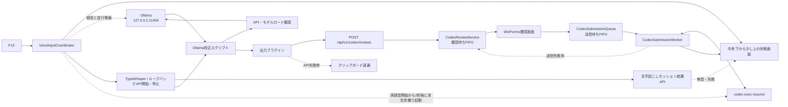

# 音声入力

## 目的と境界

F13から音声入力を開始し、TypeWhisperとOllamaで校正した本文を利用者が確認してから、指定したCodexタスクへ送信するサブシステムです。

PC・AndroidのWeb会話は[Codex会話](12_Codex会話.md)のApp Server経路です。現行の音声送信は独立して維持し、将来は確認済み本文を`CodexChatService`へ接続できます。音声用の送信先設定とWeb専用会話は共有しません。

- 音声認識と校正はTypeWhisper・Ollamaが担い、UniToDoは起動、状態表示、確認、送信を調整する。
- 業務タスク操作APIや`taskctl`とは別のレビューAPI経路だが、同じUniToDo常駐プロセス内で動作する。
- OpenAI APIは使わず、ChatGPTへログイン済みのCodex CLIを使う。
- 録音、校正本文、Codex応答はSQLite、履歴、アプリログへ保存しない。

## 全体フロー



## 構成要素

| 場所 | 責務 |
|---|---|
| `Services/VoiceInputCoordinator.cs` | 依存アプリ準備、単一起動制御、状態通知 |
| `Windows/VoiceInputRuntime.cs` | Ollama・TypeWhisper起動、両ループバックAPIの呼出し |
| `Windows/TypeWhisperApiClient.cs` | 認識モデル準備、音声校正ワークフロー、録音開始・停止状態の確認 |
| `Windows/VoiceInputHotkeyHost.cs` | 利用者向けF13のグローバル登録 |
| `Windows/VoiceInputStatusForm.cs` | フォーカスを奪わない進捗・結果表示 |
| `Services/CodexReviewService.cs` | 最大50,000文字の確認待ちをメモリ内FIFOで管理 |
| `Windows/CodexReviewForm.cs` | 本文の確認、編集、送信、破棄 |
| `Services/CodexSubmissionQueue.cs` | 確認済み本文のメモリ内送信待ち |
| `Services/CodexSubmissionWorker.cs` | Codex CLIへの直列送信と失敗時の再確認 |
| `Services/CodexCommandRunner.cs` | CLI探索、引数構築、標準入力、出力制限 |
| `Services/CodexProcessPreparation.cs` | 本文待機CLIの単一保持、送信時の受渡し、2分の期限切れ回収 |
| `integrations/TypeWhisper.Ollama/` | Windows PowerShell 5.1用の校正・要約スクリプト正本 |
| `integrations/TypeWhisper.TaskManagerOutput/` | 校正本文をループバックAPIへ渡すTypeWhisperプラグイン |
| `scripts/install-typewhisper-integration*` | バックアップ、プラグイン配置、ワークフロー更新 |

## F13から録音開始まで

1. `TaskManagerTray`がF13を受け、中央下へ準備状態を即時表示する。
2. 二重実行をロックし、起動済みのOllamaとTypeWhisperは再利用する。
3. Ollamaの起動、API応答待ち、`qwen3-typewhisper:latest`の事前ロードをバックグラウンドで開始する。
4. Ollamaを待たず、未起動のTypeWhisperを非アクティブで起動する。
5. TypeWhisperの`/v1/status`でAPI起動を、`/v1/models`で選択モデルがダウンロード済みであることを確認する。録音前の`no_model`と`loaded=false`は正常な遅延ロード待ちとして扱う。
6. `/v1/rules`から有効な「音声校正」ワークフローIDを解決し、`/v1/dictation/start`へ渡す。TypeWhisperは開始API内で選択モデルを遅延ロードするため、API応答完了を待たず`/v1/dictation/status`を並行確認し、実録音が始まった時点で開始済み表示へ進む。
7. 録音開始APIの応答待ちを含め、TypeWhisperが録音中にF13を再度押した場合は、Ollama準備の完了・未完了にかかわらず開始待ちを取り消し、`/v1/dictation/stop`で停止する。録音停止を確認してから文字起こし・校正待ち表示へ進み、停止応答のセッションIDを保持する。
8. `/v1/dictation/transcription?id=<セッションID>`を処理完了まで確認する。無音または短すぎる音声は確認本文なしの正常終了として「音声が検出されなかったため、音声入力を終了しました」と表示する。その他の文字起こし失敗は原因付きエラーを表示し、2分以内に結果を確認できない場合も待機表示を終了する。新しい録音開始後は古いセッション結果で現在の表示を上書きしない。
9. 本文が生成された場合は、校正スクリプトが`/api/tags`と`/api/ps`を確認し、対象モデルのロード完了後にだけ原文をOllamaへ送る。

TypeWhisper APIは`127.0.0.1:8978`で有効化し、起動後の`api-discovery.json`から現在のポートと任意の認証トークンを取得します。API受付やキー送信だけでは開始・停止成功とみなさず、F13ごとに本体の録音状態を同期します。TypeWhisper側でEsc停止した場合も停止済みと認識し、次回F13は新規録音を開始します。Ollamaのバックグラウンド準備に失敗しても録音開始は妨げず、校正スクリプトが最大45秒待ってから原文維持へフォールバックします。

## Qwenによる校正

- `qwen3-typewhisper:latest`の校正指示はsystem、原文は`<transcript>`で区切ったpromptへ分離する。規則はノイズ除去、文脈による同音・類似音修正、言い直しと意味の保持にまとめ、短い例を添える。要約プロファイルの指示は別管理。
- モデル応答後、引用を含まない本文の文頭・文境界にある読点付きの「えっと」「えーと」「あー」と、句点等の後に独立して付いた末尾の「はい」を補助処理で除く。「はい」単独、返答、引用、指示語「あの資料」は一括置換しない。
- 原文の引用が応答から欠落した場合、空応答、生成上限到達、API障害では原文を維持する。校正出力枠は本文文字数の2倍+128、最低384・最大2048トークン。長文の完全な校正は保証しない。
- `tests/Test-OllamaCorrection.ps1`は通常テストでノイズ除去と引用保護を検証する。PowerShell 7で`-LiveModel`を指定すると、ローカルOllamaに合成26例を送り完全一致数と不一致を表示する。モデル依存の品質評価なので通常テストの合否とは分離する。
- 4B量子化モデルでの合成例評価は26例中24例が完全一致。プロンプト調整に使った例を含み、実音声の精度指標ではない。「風量」「強度」の例は修正できても「扇風機」「火力」では「今日→強」が残るなど、未提示の表現への一般化には限界がある。確認画面で内容を確認する。

## 確認とCodex送信

- 出力プラグインは`POST /api/v1/codex/reviews`へ`{"text":"..."}`とローカル更新ヘッダーを送る。
- APIは非対話環境では503を返す。転送失敗時はプラグインが本文をクリップボードへ退避する。
- 確認画面はSQLite設定の非同期読込後に必ずWinFormsスレッドへ戻し、F13押下時の前面ディスプレイ作業領域内へ完全に収める。F13を経由しない復元時も中央下の進捗画面を先に用意し、その画面を所有元とする最前面モーダル画面として1件ずつ表示する。閉じた後に後続のFIFO待機項目を表示する。
- Enterは改行、`Ctrl+Enter`または送信ボタンは送信、Esc・破棄・閉じる操作は破棄とする。
- 送信失敗時は編集後本文をFIFO先頭へ戻し、再確認できるようにする。

Codex CLIは公式Windowsインストーラー版の実パッケージを直接使い、本文を標準入力へ渡します。

実録音開始の確認後、TypeWhisper・Ollamaの初期起動との負荷集中を緩和するため2秒遅らせ、同じ`codex exec resume ... -`を標準入力待ちで事前起動します。録音・停止・校正はCLI準備を待ちません。送信先未設定なら起動せず、準備失敗でも音声入力を継続します。事前起動はプロセス起動の前倒しであり、会話復元・モデル要求・ツール初期化までの完了を保証しません。確認前には本文もダミー依頼も送りません。

待機プロセスは最大1個で、同じ起動設定なら再利用し、確認済み本文の送信時に所有権を送信ワーカーへ渡します。破棄・無音・Esc後も未使用プロセスは起動から2分以内に回収します。期限切れ・早期終了・送信先変更では本文送信前に通常起動へ戻します。送信開始後は自動再送しません。アプリ終了時は待機プロセスと送信中の所有プロセスを終了し、本文なしの標準入力終了による依頼実行は行いません。

```text
codex exec --model gpt-5.6-luna
  --config model_reasoning_effort="low"
  --config service_tier="fast"
  --enable fast_mode
  --skip-git-repo-check
  --add-dir <TaskManager配置先>
  resume <設定済みタスクID> -
```

- 設定値はこのプロセスだけへ適用し、利用者の`config.toml`を変更しない。
- 常駐アプリはGit管理外のインストール先から起動するため、リポジトリ検査だけを省略する。サンドボックスと通常の承認設定は変更しない。
- 音声送信の非対話CLI呼び出しに限り、Google Calendarアプリのツール確認は`approve`とする。他アプリの確認やシェル承認には適用しない。
- シェルや引数へ本文を埋め込まない。
- Microsoft Store版の`WindowsApps`実行ファイルと公開`bin`ジャンクションは使わない。
- 標準出力は末尾優先で最大4,000文字を表示し、保存しない。
- 送信中、成功、失敗はWindows通知ではなく同じ中央下画面へ表示する。
- 状態画面はTypeWhisperの表示と重ならないよう作業領域の下端から84px空ける。通常の状態文は内容に合わせて横幅を最大900pxまで広げ、さらに長い場合は省略せず折り返す。
- 結果画面は内容に応じて拡縮し、必要時だけスクロールし、標準30秒で閉じる。
- 確認画面の受付・表示・終了メタデータは`logs/voice-review-YYYY-MM-DD.log`へ記録するが、音声本文と送信先は記録しない。

## 導入と設定

実行コマンドは[READMEの音声入力連携](../../README.md#音声入力連携)に記載します。

1. Ollama、TypeWhisper、公式Windowsインストーラー版Codex CLIを導入し、CLIでログインする。
2. TypeWhisperを終了する。
3. `./scripts/install-typewhisper-integration.ps1 -WhatIf`で変更対象を確認する。
4. 同スクリプトを通常実行し、TypeWhisper API、プラグイン、校正スクリプト、手動予備操作用のF14・F15を構成する。
5. UniToDo設定画面で送信先CodexタスクIDを指定する。
6. F13経路を実機確認する。

移行前のTypeWhisper設定は`%LOCALAPPDATA%\TypeWhisper-UserData\Backups`へ退避します。校正スクリプトはWindows PowerShell 5.1で日本語を安全に解析できるようUTF-8 BOM付きで配置するため、外部配置先を直接編集せず移行スクリプトを再実行します。

校正スクリプトだけを更新する場合は、PowerShell 7で`./scripts/install-typewhisper-integration.ps1 -CorrectionScriptOnly -WhatIf`を確認後、`-WhatIf`なしで実行します。導入済みスクリプトだけをバックアップして差し替え、設定・プラグインは変更しません。次の校正呼出しから反映されます。

## セキュリティとデータ保護

- UniToDo APIは`127.0.0.1:48120`、自動起動Ollamaは`127.0.0.1:11434`、TypeWhisper APIは`127.0.0.1:8978`だけで待ち受ける。
- TypeWhisperがAPI認証を要求する設定では、起動時のディスカバリーファイルからトークンを読み、音声本文やログへ保存しない。
- レビューAPIは`LocalRequestMiddleware`と`X-TaskManager-Request: local`で保護する。
- Codex送信は既存CLI認証を利用し、サンドボックス解除や全承認回避フラグを付けない。Google Calendarだけは音声送信の実行中に限定したアプリ設定で自動承認する。
- 設定へ保存するのは送信先タスクIDであり、音声本文と応答はメモリ内だけで扱う。
- アプリ終了時の未送信FIFOは永続化・復元しない。

## テスト観点

- F13受付、連打時の単一実行、開始API待ちを含む録音中の2回目押下によるAPI停止、Esc停止後の再開、依存アプリの必要時起動と再利用
- TypeWhisper API・認識モデル準備後のワークフロー開始、開始・停止状態確認、Ollama起動・モデルロードの並行処理
- 停止応答のセッションID、文字起こし結果の処理中・完了・無音・失敗、無音時の待機表示終了、古い結果による新規録音表示の上書き防止
- 録音停止後のOllama API・対象モデル確認、準備完了前に本文を生成APIへ送らないこと
- 空本文・50,000文字超の拒否、確認FIFO、送信と破棄
- タスクID正規化、CLI引数、標準入力、直列実行、失敗時再確認
- 実録音開始後の事前準備要求、本文なしの入力待機、同じプロセスの再利用、重複起動防止、待機期限・早期終了・送信先変更時の通常起動、取消しと終了時の回収
- 進捗・結果表示、応答長制限、Windows通知と永続化を使わないこと
- API障害時のクリップボード退避

## 障害切り分け

| 症状 | 確認先 |
|---|---|
| F13に反応しない | UniToDo常駐、F13重複登録、旧F13補助ツール、TypeWhisper API有効化 |
| 準備表示のまま進まない | TypeWhisperプロセス、API有効化、`/v1/models`の選択モデル・`status=ready`、30秒タイムアウト |
| 開始・停止表示とTypeWhisperが一致しない | `/v1/dictation/status`、開始API応答と実録音開始の順序、`api-discovery.json`のポート・トークン、音声校正ワークフローの有効状態 |
| 校正されず原文のまま | Script Runner、校正スクリプトのUTF-8 BOM、`TYPEWHISPER_PROFILE`、Ollamaの`/api/tags`・`/api/ps`、45秒タイムアウト |
| 確認画面が出ない | `/v1/dictation/transcription?id=<セッションID>`の`status`・`error`、本文ありの場合は出力プラグイン、`/api/v1/health`、レビューAPIの保護ヘッダー、クリップボード退避。無音時は確認画面を表示せず終了メッセージへ進む |
| `Not inside a trusted directory` | Git管理外の常駐アプリ配置先から起動するため、CLI引数の`--skip-git-repo-check`を確認する。サンドボックス解除で迂回しない |
| Codex送信に失敗する | 実パッケージCLI、CLIログイン、モデル・高速モード、クレジット、送信先タスクID、`--add-dir` |
| 成功後に結果がない | 中央下のCLI応答、応答本文なし表示、送信先タスクの処理結果 |

TypeWhisperの版やAPI設定を変更した場合は単体テストだけでなく、UniToDoのF13開始、2回目のF13停止、確認画面表示までを実機確認します。
